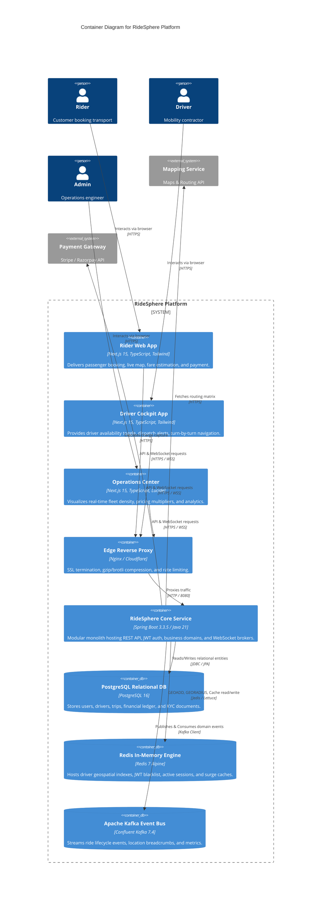

# C4 Model - Container Diagram

## RideSphere Architecture Containers

```mermaid
C4Container
    title Container Diagram for RideSphere Platform

    Person(rider, "Rider", "Customer booking transport")
    Person(driver, "Driver", "Mobility contractor")
    Person(admin, "Admin", "Operations engineer")

    System_Boundary(c1, "RideSphere Platform") {
        Container(rider_web, "Rider Web App", "Next.js 15, TypeScript, Tailwind", "Delivers passenger booking, live map, fare estimation, and payment.")
        Container(driver_web, "Driver Cockpit App", "Next.js 15, TypeScript, Tailwind", "Provides driver availability toggle, dispatch alerts, turn-by-turn navigation.")
        Container(admin_web, "Operations Center", "Next.js 15, TypeScript, Lucide", "Visualizes real-time fleet density, pricing multipliers, and analytics.")
        
        Container(edge_proxy, "Edge Reverse Proxy", "Nginx / Cloudflare", "SSL termination, gzip/brotli compression, and rate limiting.")

        Container(backend_app, "RideSphere Core Service", "Spring Boot 3.3.5 / Java 21", "Modular monolith hosting REST API, JWT auth, business domains, and WebSocket brokers.")

        ContainerDb(pg_db, "PostgreSQL Relational DB", "PostgreSQL 16", "Stores users, drivers, trips, financial ledger, and KYC documents.")
        ContainerDb(redis_cache, "Redis In-Memory Engine", "Redis 7 Alpine", "Hosts driver geospatial indexes, JWT blacklist, active sessions, and surge caches.")
        ContainerDb(kafka_bus, "Apache Kafka Event Bus", "Confluent Kafka 7.4", "Streams ride lifecycle events, location breadcrumbs, and metrics.")
    }

    System_Ext(maps_api, "Mapping Service", "Maps & Routing API")
    System_Ext(payment_api, "Payment Gateway", "Stripe / Razorpay API")

    Rel(rider, rider_web, "Interacts via browser", "HTTPS")
    Rel(driver, driver_web, "Interacts via browser", "HTTPS")
    Rel(admin, admin_web, "Interacts via browser", "HTTPS")

    Rel(rider_web, edge_proxy, "API & WebSocket requests", "HTTPS / WSS")
    Rel(driver_web, edge_proxy, "API & WebSocket requests", "HTTPS / WSS")
    Rel(admin_web, edge_proxy, "API & WebSocket requests", "HTTPS / WSS")

    Rel(edge_proxy, backend_app, "Proxies traffic", "HTTP / 8080")

    Rel(backend_app, pg_db, "Reads/Writes relational entities", "JDBC / JPA")
    Rel(backend_app, redis_cache, "GEOADD, GEORADIUS, Cache read/write", "Jedis / Lettuce")
    Rel(backend_app, kafka_bus, "Publishes & Consumes domain events", "Kafka Client")

    Rel(backend_app, maps_api, "Fetches routing matrix", "HTTPS")
    Rel(backend_app, payment_api, "Executes charge capture", "HTTPS")
```
