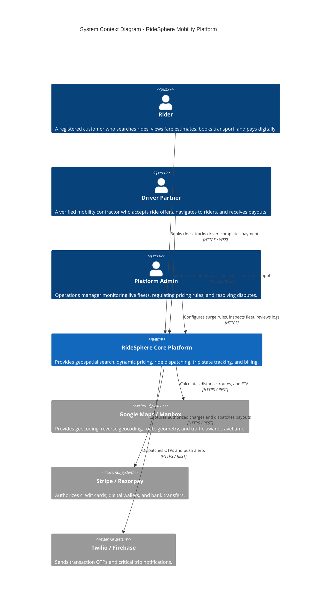

# C4 Model - Context Diagram (System Context)

## System Context for RideSphere (Urban Ride)

```mermaid
C4Context
    title System Context Diagram - RideSphere Mobility Platform

    Person(rider, "Rider", "A registered customer who searches rides, views fare estimates, books transport, and pays digitally.")
    Person(driver, "Driver Partner", "A verified mobility contractor who accepts ride offers, navigates to riders, and receives payouts.")
    Person(admin, "Platform Admin", "Operations manager monitoring live fleets, regulating pricing rules, and resolving disputes.")

    System(ridesphere, "RideSphere Core Platform", "Provides geospatial search, dynamic pricing, ride dispatching, trip state tracking, and billing.")

    System_Ext(maps, "Google Maps / Mapbox", "Provides geocoding, reverse geocoding, route geometry, and traffic-aware travel time.")
    System_Ext(payment_gw, "Stripe / Razorpay", "Authorizes credit cards, digital wallets, and bank transfers.")
    System_Ext(sms_gw, "Twilio / Firebase", "Sends transaction OTPs and critical trip notifications.")

    Rel(rider, ridesphere, "Books rides, tracks driver, completes payments", "HTTPS / WSS")
    Rel(driver, ridesphere, "Sends live telemetry, accepts trips, confirms dropoff", "HTTPS / WSS")
    Rel(admin, ridesphere, "Configures surge rules, inspects fleet, reviews logs", "HTTPS")

    Rel(ridesphere, maps, "Calculates distance, routes, and ETAs", "HTTPS / REST")
    Rel(ridesphere, payment_gw, "Captures authorized charges and dispatches payouts", "HTTPS / REST")
    Rel(ridesphere, sms_gw, "Dispatches OTPs and push alerts", "HTTPS / REST")
```
