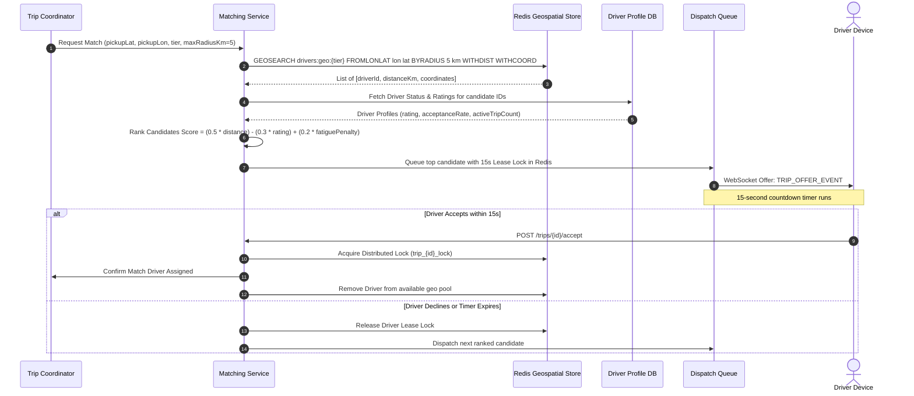

# Sequence Diagram: Intelligent Geospatial Driver Matching

```mermaid
sequenceDiagram
    autonumber
    participant Core as Trip Coordinator
    participant Matcher as Matching Service
    participant Redis as Redis Geospatial Store
    participant DB as Driver Profile DB
    participant Dispatcher as Dispatch Queue
    actor Driver as Driver Device

    Core->>Matcher: Request Match (pickupLat, pickupLon, tier, maxRadiusKm=5)
    Matcher->>Redis: GEOSEARCH drivers:geo:{tier} FROMLONLAT lon lat BYRADIUS 5 km WITHDIST WITHCOORD
    Redis-->>Matcher: List of [driverId, distanceKm, coordinates]

    Matcher->>DB: Fetch Driver Status & Ratings for candidate IDs
    DB-->>Matcher: Driver Profiles (rating, acceptanceRate, activeTripCount)

    Matcher->>Matcher: Rank Candidates Score = (0.5 * distance) - (0.3 * rating) + (0.2 * fatiguePenalty)
    Matcher->>Dispatcher: Queue top candidate with 15s Lease Lock in Redis

    Dispatcher->>Driver: WebSocket Offer: TRIP_OFFER_EVENT
    Note over Dispatcher, Driver: 15-second countdown timer runs

    alt Driver Accepts within 15s
        Driver->>Matcher: POST /trips/{id}/accept
        Matcher->>Redis: Acquire Distributed Lock (trip_{id}_lock)
        Matcher->>Core: Confirm Match Driver Assigned
        Matcher->>Redis: Remove Driver from available geo pool
    else Driver Declines or Timer Expires
        Matcher->>Redis: Release Driver Lease Lock
        Matcher->>Dispatcher: Dispatch next ranked candidate
    end
```
