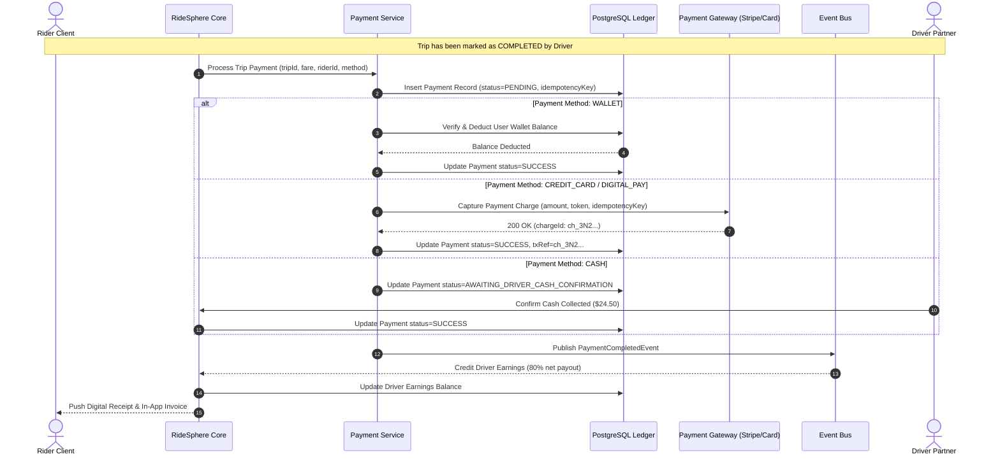

# Sequence Diagram: Payment Processing Flow

```mermaid
sequenceDiagram
    autonumber
    actor Rider as Rider Client
    participant Core as RideSphere Core
    participant PaySvc as Payment Service
    participant PG as PostgreSQL Ledger
    participant Stripe as Payment Gateway (Stripe/Card)
    participant Kafka as Event Bus
    actor Driver as Driver Partner

    Note over Rider, Driver: Trip has been marked as COMPLETED by Driver

    Core->>PaySvc: Process Trip Payment (tripId, fare, riderId, method)
    PaySvc->>PG: Insert Payment Record (status=PENDING, idempotencyKey)
    
    alt Payment Method: WALLET
        PaySvc->>PG: Verify & Deduct User Wallet Balance
        PG-->>PaySvc: Balance Deducted
        PaySvc->>PG: Update Payment status=SUCCESS
    else Payment Method: CREDIT_CARD / DIGITAL_PAY
        PaySvc->>Stripe: Capture Payment Charge (amount, token, idempotencyKey)
        Stripe-->>PaySvc: 200 OK (chargeId: ch_3N2...)
        PaySvc->>PG: Update Payment status=SUCCESS, txRef=ch_3N2...
    else Payment Method: CASH
        PaySvc->>PG: Update Payment status=AWAITING_DRIVER_CASH_CONFIRMATION
        Driver->>Core: Confirm Cash Collected ($24.50)
        Core->>PG: Update Payment status=SUCCESS
    end

    PaySvc->>Kafka: Publish PaymentCompletedEvent
    Kafka-->>Core: Credit Driver Earnings (80% net payout)
    Core->>PG: Update Driver Earnings Balance
    Core-->>Rider: Push Digital Receipt & In-App Invoice
```
