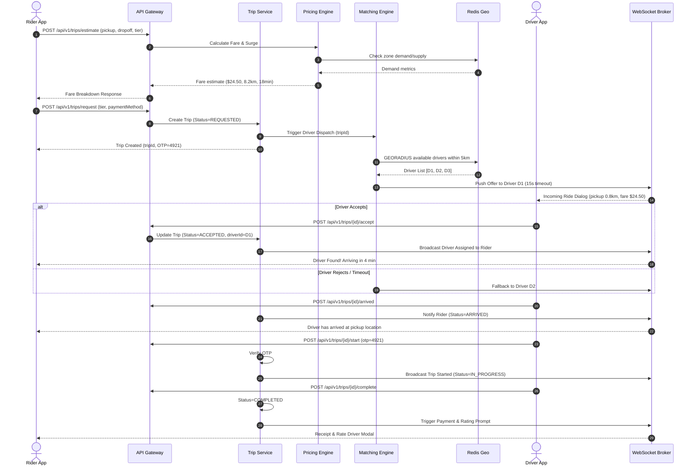

# Sequence Diagram: Ride Booking Lifecycle

```mermaid
sequenceDiagram
    autonumber
    actor Rider as Rider App
    participant GW as API Gateway
    participant TripSvc as Trip Service
    participant PriceSvc as Pricing Engine
    participant MatchSvc as Matching Engine
    participant Redis as Redis Geo
    actor Driver as Driver App
    participant WS as WebSocket Broker

    Rider->>GW: POST /api/v1/trips/estimate (pickup, dropoff, tier)
    GW->>PriceSvc: Calculate Fare & Surge
    PriceSvc->>Redis: Check zone demand/supply
    Redis-->>PriceSvc: Demand metrics
    PriceSvc-->>GW: Fare estimate ($24.50, 8.2km, 18min)
    GW-->>Rider: Fare Breakdown Response

    Rider->>GW: POST /api/v1/trips/request (tier, paymentMethod)
    GW->>TripSvc: Create Trip (Status=REQUESTED)
    TripSvc->>MatchSvc: Trigger Driver Dispatch (tripId)
    TripSvc-->>Rider: Trip Created (tripId, OTP=4921)

    MatchSvc->>Redis: GEORADIUS available drivers within 5km
    Redis-->>MatchSvc: Driver List [D1, D2, D3]
    MatchSvc->>WS: Push Offer to Driver D1 (15s timeout)
    WS-->>Driver: Incoming Ride Dialog (pickup 0.8km, fare $24.50)

    alt Driver Accepts
        Driver->>GW: POST /api/v1/trips/{id}/accept
        GW->>TripSvc: Update Trip (Status=ACCEPTED, driverId=D1)
        TripSvc->>WS: Broadcast Driver Assigned to Rider
        WS-->>Rider: Driver Found! Arriving in 4 min
    else Driver Rejects / Timeout
        MatchSvc->>WS: Fallback to Driver D2
    end

    Driver->>GW: POST /api/v1/trips/{id}/arrived
    TripSvc->>WS: Notify Rider (Status=ARRIVED)
    WS-->>Rider: Driver has arrived at pickup location

    Driver->>GW: POST /api/v1/trips/{id}/start (otp=4921)
    TripSvc->>TripSvc: Verify OTP
    TripSvc->>WS: Broadcast Trip Started (Status=IN_PROGRESS)

    Driver->>GW: POST /api/v1/trips/{id}/complete
    TripSvc->>TripSvc: Status=COMPLETED
    TripSvc->>WS: Trigger Payment & Rating Prompt
    WS-->>Rider: Receipt & Rate Driver Modal
```
